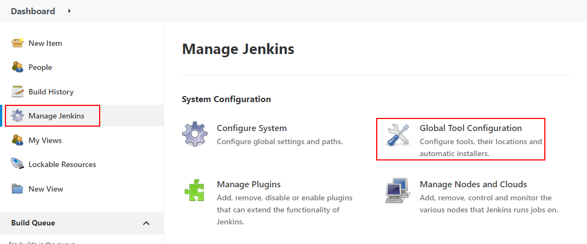
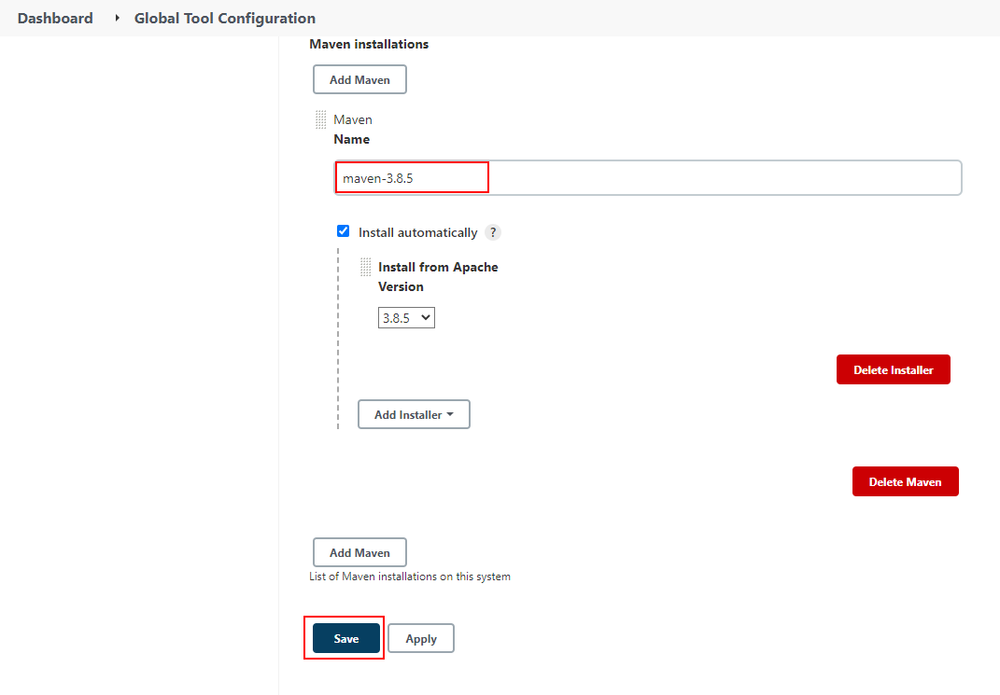
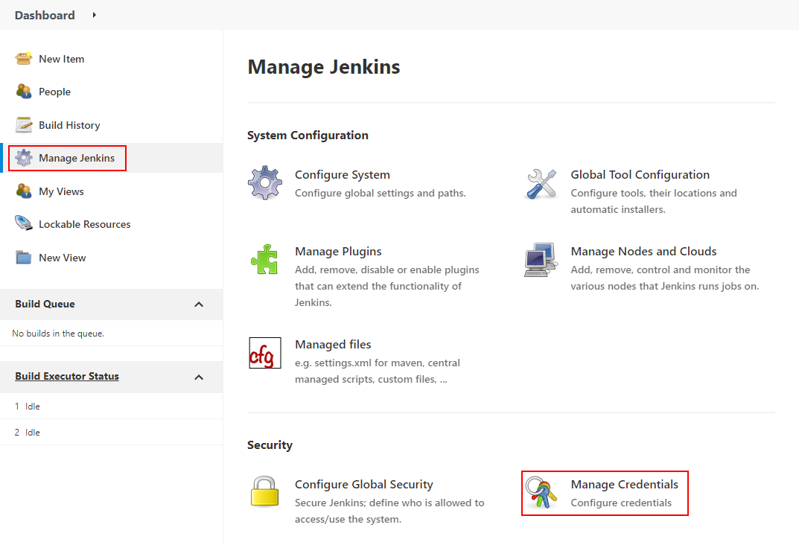

## Run Jenkins container
```
# docker run -d -p 8080:8080 -p 50000:50000 jenkins/jenkins:lts
```


##Enter container as root (necesary to install software)

```
# docker exec -u 0 -it <CONTAINER_ID> bash
```

## Install Maven
in the dashboard go to "Manage Jenkins", then "Global Tool Configuration"



Give the installer a name and then click "Save"




## Install NPM and nodeJS inside the container

Enter the container as root user and run

```
# apt install nodejs -y

# apt install npm -y
```


## Create a free style job
Give the project a name and select Free Style Project

In the configuration console, scroll down to the build section and click "Add build step"

Then select "Execute shell"

## Add git credentials
Go to Dashboard -> Manage Jenkins -> Manage Credentials
